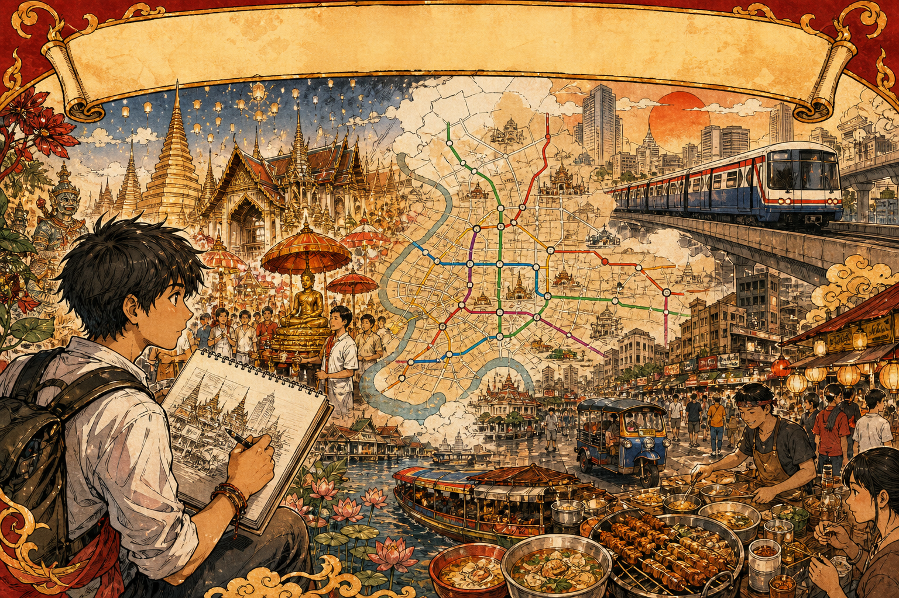
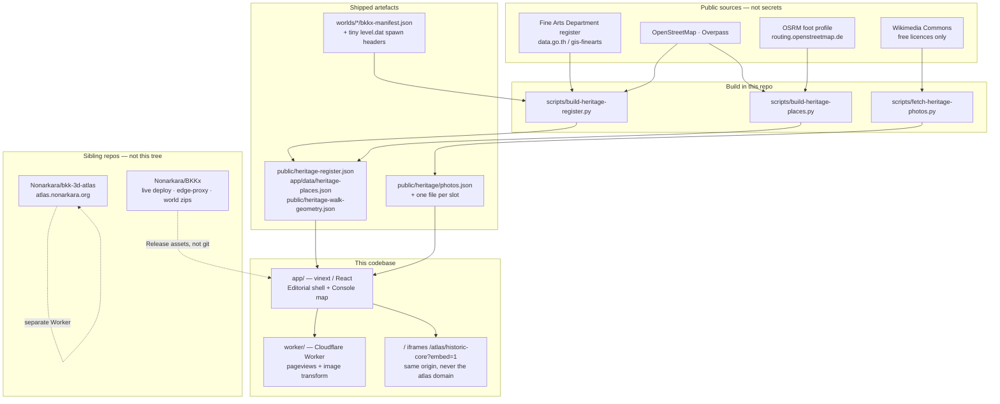

<p align="center">
  
</p>

<p align="center"><em>Heritage, transit and street life on one sheet — a civic studio, not a sealed console.<br />
The central HUD in this banner (the schematic river map, coloured rail lines, station nodes and temple pins) is <strong>illustration only</strong>. It is concept artwork, not the running interface.</em></p>

# BKKxCulture

**[bkk.nonarkara.org](https://bkk.nonarkara.org)** is Bangkok's heritage register, mapped honestly: 571 Fine Arts Department monuments, nine authored quarters, seven street-following walks, and a 3D map as the front door. This repository is the dedicated, independently-buildable source for that Culture site.

It is the Culture half of the **BKKx** pair. It is not the whole pair.

| Sibling | Job | Live from, right now |
| --- | --- | --- |
| **This repo** — [`Nonarkara/BKKxCulture`](https://github.com/Nonarkara/BKKxCulture) | Editorial culture site: register, quarters, walks, heritage atlas shell | Dedicated source going forward. **Not yet the live deploy.** |
| [`Nonarkara/BKKx`](https://github.com/Nonarkara/BKKx) | Parent civic-atlas monorepo: this site's live Worker, `edge-proxy/` for `bkk.nonarkara.org`, Minecraft world manifests **and** the GitHub Release zips | **[bkk.nonarkara.org](https://bkk.nonarkara.org) still deploys from here.** |
| [`Nonarkara/bkk-3d-atlas`](https://github.com/Nonarkara/bkk-3d-atlas) | Operational digital twin — traffic, air, heat, rain, flooding, CCTV, land price | **[atlas.nonarkara.org](https://atlas.nonarkara.org)**. Separate repo, separate Worker, separate visual register. |

Last brought current with `Nonarkara/BKKx` at commit `d3388d1`. A change merged here is not live on `bkk.nonarkara.org` until the monorepo ships it. The homepage iframe is `/atlas/historic-core?embed=1` on **this** origin — never `https://atlas.nonarkara.org`. Pointing that iframe at the sibling domain is what made the culture site look like the atlas to its owner.

This snapshot does **not** contain `edge-proxy/`, the rowhouse atlas, the war room, or live civic adapters. Those live in [`Nonarkara/BKKx`](https://github.com/Nonarkara/BKKx). World binaries are not in git here; they are [GitHub Release assets on BKKx](https://github.com/Nonarkara/BKKx/releases/latest).

---

## 1. What this is

A **civic heritage studio** for Bangkok: a public, inspectable picture of what the Fine Arts Department already lists, where those monuments can actually be placed, and how a visitor might walk between them. It is not a municipal product and not a live operations console.

What this codebase ships:

| Surface | What you actually get |
| --- | --- |
| `/` | 3D map front door — nine quarter chips fly a same-origin Historic Core embed |
| `/heritage` | Fine Arts Department register, 571 Bangkok monuments, mapped honestly |
| `/areas/:slug` | Nine authored quarters, each with a licence-checked Commons photo |
| `/walks/:slug` | Seven walks on real OSRM foot geometry, not straight-line guesses |
| `/about` | Why the project exists — first-person essay |
| `/worlds`, `/atlas/:district` | Minecraft walkthrough of two generated districts |

**The register.** Not the dataset most people reach for first — [`vw_important_architecture`](https://data.go.th/dataset/vw_important_architecture) (Ministry of Culture) covers 72 provinces and contains **zero Bangkok records**. It cannot describe this city. This uses the [Fine Arts Department register](https://data.go.th/dataset/gis-finearts) (`gis-finearts`) instead: 8,341 monuments nationwide, 571 in Bangkok. In the payload here: 201 gazetted, 370 awaiting consideration.

**The coordinate problem.** 397 of those 571 rows publish latitude to two decimal places — about 1.1 km. In the Historic Core, 181 monuments collapse onto 12 distinct points, 37 of them stacked on one. Pinning those as-published would put dozens of temples inside each other and hand out Minecraft coordinates that lead nowhere. `scripts/build-heritage-register.py` resolves each row in order — the register's own coordinate when it is precise enough, an OpenStreetMap match by name otherwise, nothing if neither works — and records which method won in `locatedBy`. A row that matches nothing keeps district precision and is never pinned or given a block coordinate. The register says so on the page rather than guessing. In this snapshot: 311 building-precision, 260 unlocated, 125 walkable inside a generated world.

Fuzzy name matching carries two guards, both written after real bad matches: digits must agree (a match nearly put a Rama VI bridge citation on the Rama VIII bridge), and the register's type word (วัด, สะพาน, ป้อม…) must appear in the OpenStreetMap name too (a match nearly put a temple on the neighbourhood it sits in). `self_check()` asserts both guards and the fuzzy cutoff on every build.

**Nine quarters, seven walks.** Rattanakosin, Kudi Chin, Talad Noi, Song Wat, Yaowarat & Sampheng, Sam Phraeng, Nang Loeng, Charoen Krung, Bang Krachao — each an authored page, not a database dump. Walks use OSRM's public foot profile (FOSSGIS / `routing.openstreetmap.de`). If the router is down at build time, distances are omitted and the page says so. Hand-placed stops are flagged `approx` with a reason. Where a walk stop falls inside a generated world, the page shows the `/tp` command; 15 of 48 stops in this snapshot do. The 125 Minecraft coordinates on the register itself are a separate count — monuments inside world bounds, not walk-page stops.

**Bilingual.** Quarters, walks and the essay toggle English/Thai. The register's own raw government prose stays untranslated — that volume was out of scope, and the site says so rather than leaving a silent gap.

**The Minecraft worlds.** Two districts generated from OpenStreetMap, Overture Maps and land-cover data, playable in Minecraft Java Edition 1.21.4+. Teleport height is read from each world's `level.dat` (these superflat worlds ground near y = −60; Minecraft's default spawn of 64 would drop a visitor over 100 blocks). The `.mca` region files are not duplicated here.

| World | Coverage | Size | Validated chunks |
| --- | --- | ---: | ---: |
| Ratchathewi / ราชเทวี | Victory Monument, Phaya Thai, Pratunam and Makkasan | 4.96 × 2.95 km | 61,440 |
| Historic Core / เกาะรัตนโกสินทร์ | Phra Nakhon, Chao Phraya and adjacent Thonburi | 3.38 × 3.22 km | 50,176 |

Both use a 1 block = 1 metre local projection and open in Creative mode. Download the zips from [BKKx Releases](https://github.com/Nonarkara/BKKx/releases/latest).

---

## 2. Philosophy / invitation

Bangkok is a living city that never got the UNESCO plaque. This project does not exist to invent one. A civic atlas is the other kind of plaque: a public instrument that admits, layer by layer, what is known, what is hoped for, and what must not be claimed yet.

The banner's central map — river, rail, pins — is the *idea* of that instrument. The software in this repository is the slower, sourced version: every pin has a `locatedBy`, every photo has a licence or it does not render, every unlocated monument stays a district row instead of a plausible-looking guess.

**Fork the method, not the secrets.**

There are no unpublished agency feeds in this snapshot, and no keys to copy. The portable part is the discipline already written into the build scripts:

1. **A register before a map.** Start from an official open list (here: Fine Arts Department, CC BY). Do not substitute a national dataset that happens to have zero records for your city.
2. **Never invent a reading.** A pin, a walking distance, a `/tp`, a photograph — each is sourced, or it is omitted with a sentence. An unlocated temple and a temple at a guessed corner are opposite facts.
3. **Match with guards, then assert them.** Fuzzy names are how this city is spelled; they are also how you put a bridge on the wrong river. The guards that failed once are `self_check()` now.
4. **A licence on record, or no image.** Wikimedia Commons only, machine-checked to PD / CC0 / CC-BY / CC-BY-SA. A slot with no attribution renders nothing.
5. **A key in a repository is a leak**, including in a private one. This Worker has no live-feed secrets. Cloudflare bindings that exist (D1 for pageviews) are infrastructure, not passwords to paste into a fork.

Take the pattern to another city. Swap the register, keep the fields. Re-check licences for *your* deployment. Do not copy anyone else's keys, private endpoints, or unpublished operational URLs — this repo does not contain them, and a fork should not grow them in git.

The fuller argument, in the first person, is at [`/about`](https://bkk.nonarkara.org/about).

---

## 3. Ethical use

BKKxCulture is an independent civic project. **It is not an official product of the Fine Arts Department, the Bangkok Metropolitan Administration, or any other Thai government agency**, unless a document committed in this repository expressly says so. Open data reused here remains those agencies' data; this studio's curation does not confer official status.

When you reuse this work:

- **Attribute.** Code is MIT (see [§6](#6-license)). Geographic data, the register and photos keep their own licences — OpenStreetMap (ODbL), Overture where a world manifest says so, Fine Arts Department (CC BY), Wikimedia Commons per-file.
- **Do not treat pins as law.** A mapped monument is a register row we could locate, not a cadastral parcel, a conservation boundary or a demolition notice. District-precision rows are unlocated, not "somewhere in the amphoe, close enough."
- **Do not use this map for regulation, demolition, valuation, ownership or emergency dispatch.**
- **Do not invent coordinates, distances or photos to make a demo look complete.** A fabricated pin is worse than an unlocated row that explains itself.
- **Do not commit secrets.** This snapshot has no live civic API keys. Forks must obtain their own authorised access if they add any, and keep those values in Worker environment variables — not in git, not in this README, not in error strings.
- **Do not point the homepage iframe at `atlas.nonarkara.org`.** The culture shell frames a same-origin atlas path. The operational twin is a different system.

Photos: Wikimedia Commons only, one per slot, full attribution on every page that uses one. See `public/heritage/photos.json`. Generated Minecraft worlds are city-scale models, not survey-grade engineering twins.

---

## 4. How the system works

Public catalogues in, sourced files out, a Worker that serves the site and counts visits without taking keys.



**Editorial frames, Console focus.** The heritage shell is paper, Sao Chingcha, one oxide accent (`#8c2f23`) meaning *gazetted*. The 3D map is a dark Console surface. Two design systems held apart — the shell frames the atlas, it does not compete with it. See `CLAUDE.md` before touching those surfaces.

**Pageviews.** A D1 table records path, referrer, Cloudflare country, `Accept-Language`, user-agent and a timestamp. No IP addresses, no credentials. Aggregate counts are exposed at `GET /api/stats`. The committed D1 database id in `vite.config.ts` is a Wrangler resource identifier so deploys are not pointed at an all-zeros placeholder; it is not a password. Forks need their own Cloudflare account and their own D1.

---

## 5. How to run / fork from what is actually in the repo

### Repository map

```text
app/          vinext/React app — routes that exist in the table above
worker/       Cloudflare Worker: pageviews + image optimization
scripts/      register, places, photos (no world installer in this snapshot)
worlds/       generation manifests + tiny level.dat headers (not the binaries)
public/       register JSON, walk geometry, Commons photos, fonts
docs/         hero banner for this README (HUD in the artwork is illustration)
tests/        node --test against the built Worker HTML
```

World binaries stay out of git and out of the website bundle. There is no `edge-proxy/` here and no `site/` prefix — the app lives at the repo root.

### Run the site

Requires Node.js `>= 22.13.0`.

```bash
npm install
npm run dev     # local vinext server
npm run build   # Cloudflare Worker bundle in dist/
npm test        # build, then node --test tests/rendered-html.test.mjs
npm run lint
```

Forks that deploy will need their own Cloudflare account, D1 binding and domain. None of those are secrets to copy from this README.

### Rebuild the heritage data

```bash
python3 scripts/build-heritage-register.py   # 571-monument register
python3 scripts/build-heritage-places.py      # 9 quarters + 7 walks + OSRM legs
python3 scripts/fetch-heritage-photos.py       # Commons, free licences, one photo per slot
```

Source pulls cache in `.cache/` (gitignored). `--refresh` / `--reroute` / `--refetch` re-fetch. Nothing here calls a private BMA operations API.

### Minecraft worlds

The playable zips are [BKKx GitHub Releases](https://github.com/Nonarkara/BKKx/releases/latest), not files in this tree. Manifests and spawn headers in `worlds/` are enough to compute `/tp` for monuments that fall inside a world. These are procedurally generated city-scale models, not survey-grade twins.

World generation itself (Arnis, bounding boxes, Anvil validation, the macOS installer) lives in [`Nonarkara/BKKx`](https://github.com/Nonarkara/BKKx) — this snapshot does not ship those scripts.

### Fork the method into another city

1. Point `scripts/build-heritage-register.py` at *your* open register, not Bangkok's Fine Arts extract, unless you are actually mapping Bangkok.
2. Keep `locatedBy`, the unlocated path, and `self_check()`-style guards. Adapt the type-words and digit rules to the language you are matching.
3. Re-read photo licences. NC/ND Commons files do not pass the gate here; do not weaken that to fill a slot.
4. Keep the homepage iframe on your own origin if you embed a map.
5. Do not paste operational URLs, keys or passwords into the fork. This repo does not have them. Do not add them as files.

---

## 6. License

Code: **MIT License** (see [LICENSE](LICENSE)). Copyright (c) 2026 Non Arkara.

Geographic data: © OpenStreetMap contributors, ODbL 1.0; supplemental building data may include Overture Maps (see each world manifest). Register data: Fine Arts Department, Creative Commons Attribution. Photos: Wikimedia Commons, individually licensed and attributed per-page — see `public/heritage/photos.json`. Generated world distributions retain their source-data attribution in each `bkkx-manifest.json`.

Minecraft is a trademark of Microsoft/Mojang. BKKxCulture is an independent open-source project and is not affiliated with or endorsed by Microsoft, Mojang, the Fine Arts Department, or the Bangkok Metropolitan Administration.
